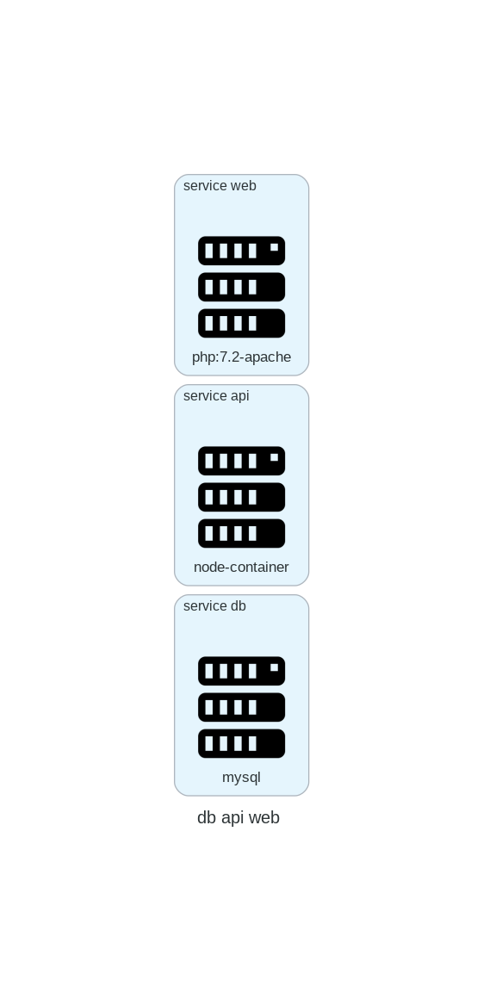

# Descriptor to Deployment Diagram (D2DD)
Creates deployment diagrams from docker-compose files. 

## Instalation
It requires **Python 3.6** or higher. In addition, you will need to install other dependencies:

- Diagram as Code;
- Graphviz;
- PyYAML;

### To install Diagram as Code:

Using pip (pip3):
```
$ pip install diagrams
```


Please refer to the [tool page](https://diagrams.mingrammer.com/docs/getting-started/installation)  for other installation options.

### Graphviz installation

To install Graphviz, please refer to the [Graphviz download page](https://graphviz.gitlab.io/download/).

### For PyYAML installation:

Using pip (pip3):

```
pip install pyyaml
```
For more details, please see the [project documentation](https://pyyaml.org/wiki/PyYAMLDocumentation)

## About Descriptors-Diagrams

In the current version, descriptors-diagrams is just a prototype. The goal is to design architecture diagrams of distributed systems from the docker-compose file. Below is a diagram constructed from the parse of a docker-compose file.

{ width=30% }


