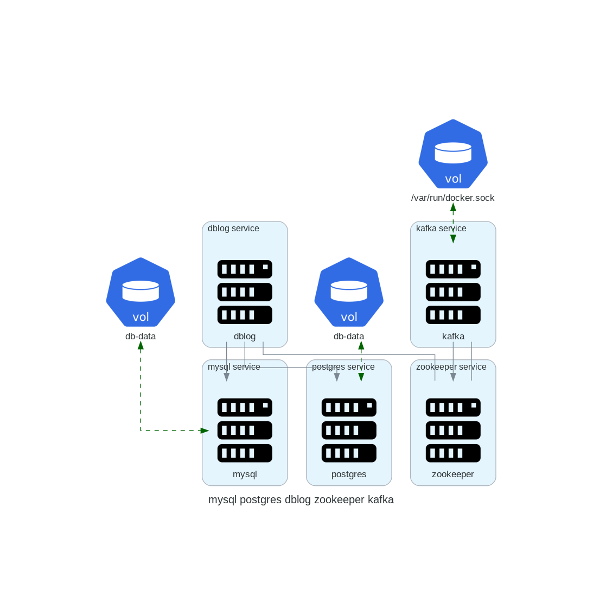

# DAD - Descriptor to Architectural Diagrams
Create system architectural diagrams from docker-compose files.

In its current version, DAD is a **prototype**.
Its goal is to design architecture diagrams of distributed systems from  docker-compose files.

DAD reads multi-container [Docker Compose](https://docs.docker.com/compose/) `.yalm` files and outputs a diagram `.png` image representing the Docker Compose file.
  
```
                  ┌────────────────────┐
                  │ Diagram .png image │
                  │                    │
  ┌───────┐       │            ┌───┐   │
  │ .yalm │       │  ┌───┐ --- │   │   │
  │  file │  ══>  │  │   │     └───┘   │
  │ ..... │       │  └───┘ \           │
  └───────┘       │         \ ┌───┐    │
                  │           │   │    │
                  │           └───┘    │
                  └────────────────────┘
```

## Setting up

In order to run DAD, all following dependencies must be installed and running.

- [Python 3](https://www.python.org/) >= 3.6;
- [pip](https://pip.pypa.io/) >= 20;
- [Diagram as Code](https://diagrams.mingrammer.com/);
- [Graphviz](https://graphviz.gitlab.io/);
- [PyYAML](https://pyyaml.org/).

## Running

To run DAD, simply run the following command in a terminal window:
```
$ python3 main.py
```

DAD will read the `docker-compose-files` input folder, and output a `diagram.png` file in the output folder.

## Example

### Input

A Docker Compose `.yalm` file.

```
version: '3.8'
services:
  mysql:
    image: mysql
    ports:
     - 3306:3306
    environment:
     - MYSQL_ROOT_PASSWORD=secret
     - MYSQL_USER=mysqluser
     - MYSQL_PASSWORD=mysqlpw
    volumes:
      - db-data:/var/lib/mysql
  postgres:
    image: postgres:9.4
    volumes:
      - db-data:/var/lib/postgresql/data
  dblog:
    build:
      context: api
      dockerfile: Dockerfile
      container_name: dblog
    restart: always
    ports:
      - "9001:9001"
    depends_on:
      - mysql
      - postgres
    links:
      - zookeeper
  zookeeper:
    image: debezium/zookeeper:${DEBEZIUM_VERSION}
    ports:
     - 2181:2181
     - 2888:2888
     - 3888:3888
  kafka:
    build:
      context: kafka
      dockerfile: Dockerfile
      container_name: kafka
    links:
      - zookeeper
    ports:
      - "9092:9092"
    environment:
      KAFKA_ADVERTISED_HOST_NAME: $CF_HOST_IP
      KAFKA_ZOOKEEPER_CONNECT: zk:2181
      KAFKA_MESSAGE_MAX_BYTES: 2000000
      KAFKA_CREATE_TOPICS: "Topic1:1:1"
    volumes:
      - /var/run/docker.sock:/var/run/docker.sock
    depends_on:
      - zookeeper
volumes:
  db-data:
```

### Output

A `.png` image file.




